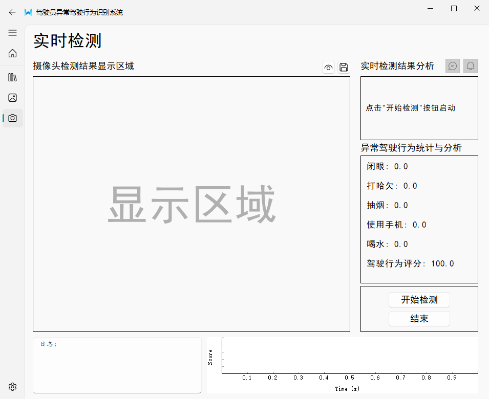

# 异常驾驶行为识别系统

## 一、项目描述
1.该项目的界面采用了PyQt5实现，模型检测使用了[YOLOv8](https://github.com/ultralytics/ultralytics)在自制数据集上训练的模型，训练结果在验证集上的PR曲线：


2.该项目主要实现了以下功能：

&emsp;&emsp;(1)图片/视频检测页面：用户能够上传图片、图片文件夹、视频进行检测，并且能够批量导出检测结果至本地。

&emsp;&emsp;(2)实时检测页面：调用本地摄像头进行实时检测，具有预警功能，支持生成、导出检测日志和得分曲线。


3.该系统能够检测八种行为：<睁眼, eye_open>,<闭眼, eye_close>,<嘴巴, mouth>, <打哈欠, yawn>, <脸, face>, <抽烟, smoke>,<使用手机, phone>, <喝水, drink>。
其中闭眼、打哈欠、抽烟、使用手机、喝水这五种行为被视作异常行为。

## 二、文件结构
```commandline
abnormal-driving-behavior
│  README.md
│  requirements.txt
│
└─adb-detector
   │  load_plot.py            # 用于加载实时检测中保存的PlotWidget绘图数据
   │  main.py                 # 🔺整个项目的运行入口
   │  mainwindow.py           # 创建系统窗口以及各组件
   │  real_time_detector.py   # 实时检测页面
   │  upload_detector.py      # 图片/视频检测页面
   │  video_surface.py        # 图片/视频检测中用来获取QMediaPlayer输出的视频帧
   │
   ├─logs                     # 实时检测中的日志、绘图数据保存位置
   |
   ├─resource                 # 界面使用的图片、音频、模型权重
   │  ├─audio
   │  ├─background
   │  ├─button
   │  └─model_weight
   │
   └─result                   # 图片/视频检测中导出的检测结果
      ├─file
      ├─folder
      └─video
```
1.`main.py`是整个项目的运行入口，代码会调用`mainwindow.py`创建窗口。

2.`mainwindow.py`主要会执行以下步骤：

&emsp;&emsp;(1)创建主页面，这一步在`mainwindow.py`中执行。

&emsp;&emsp;(2)创建图片/视频页面，通过创建`upload_detector.py`中类的对象完成。

&emsp;&emsp;(3)创建实时检测页面，通过`real_time_detector.py`中类的对象完成。

3.项目使用YOLOv8在自制数据集上训练的模型进行检测，模型位于`./adb-detector/resource/model_weight/best.pt`。

可以将其替换为自己训练的模型，然后在`main.py`里面修改`get_yolo_weight()`函数返回的路径，各页面均通过该函数获取模型路径。

<br/>

（可选阅读）

4.`video_surface.py`是在图片/视频检测中获取`QMediaPlayer`输出的视频帧，便于模型进行检测。

5.`load_plot.py`能够读取`.pkl`文件获取`PlotWidget`绘图数据进行绘图，`.pkl`文件通过实时检测页面中保存绘图数据获得。

## 三、使用说明
在cmd中cd到requirements.txt所在目录下，执行以下命令，以安装项目所需包
```commandline
pip install -r requirements.txt
```
完成后，打开项目，运行adb-detector/main.py即可

## 四、结果展示
### 主页面


### 图片/视频检测页面


### 上传视频检测


### 实时检测页面


